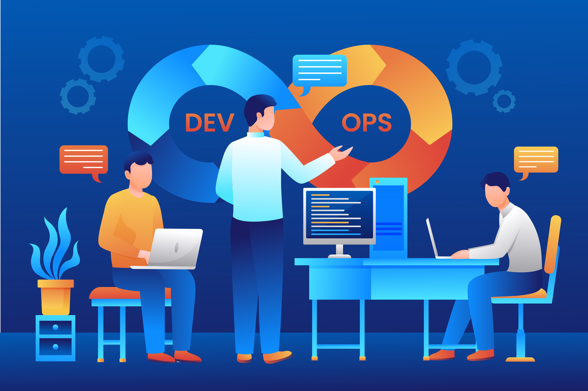

<h1 align="center">Hello! I'm Vinayak Nagaraj Naik 👋</h1>

🚀 Automating the DevOps Universe: CI/CD | Docker | Kubernetes | Ansible | Monitoring

---

  

# 💻 Tech Stack:

  
  
  
  
  
  
  

# 📊 GitHub Stats:
 
 

---

<!-- Proudly created with GPRM ( https://gprm.itsvg.in ) -->
